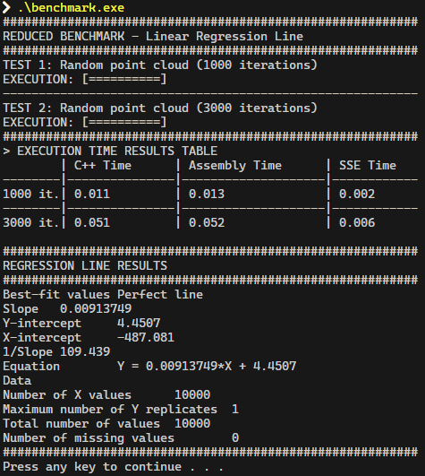
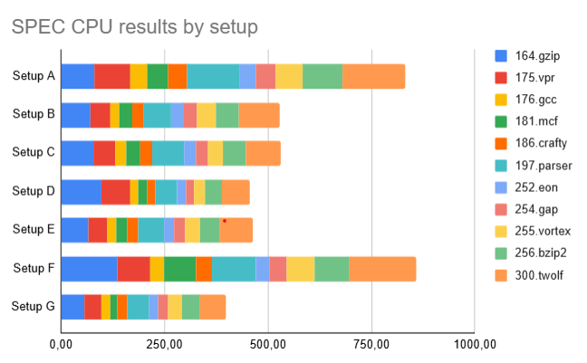
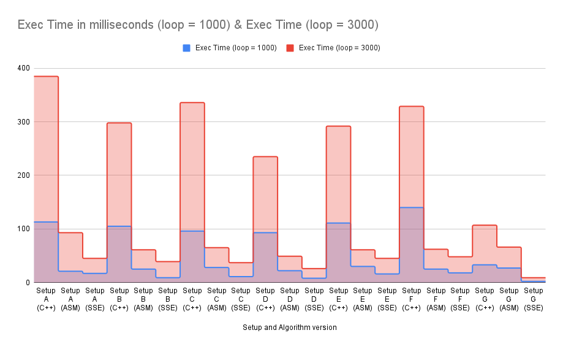

# RegressionLine-Performance-Study-x86

A performance benchmarking study comparing three implementations of linear regression line calculation: **C++**, **x86 Assembly**, and **SSE (SIMD)** instructions.

---

## 📖 Project Overview

This project implements the statistical **least squares regression line** algorithm using three different approaches to measure and compare their execution performance on x86 architecture systems.

The regression line formula is:

$$y = mx + b$$

Where:

- $m = \frac{\text{covariance}(X,Y)}{\text{variance}(X)}$
- $b$ is calculated to ensure the line passes through the mean point

Each implementation processes configurable random data points (**default: 10,000**) using **dynamic memory allocation** for scalability. Benchmarks run across multiple iterations (default 1,000 and 3,000) to measure execution time differences.



---

## 🔬 Implementation Details

### The Regression Line in C++

Standard high-level C++ implementation using:

- Dynamic arrays for X and Y coordinates (heap-allocated for large datasets)
- Sequential calculation of means, variance, and covariance
- Clock-based timing for performance measurement
- Proper memory cleanup with `delete[]`

### The Regression Line in Assembly (x8086)

Low-level x86 assembly implementation featuring:

- Direct register manipulation (`eax`, `ebx`, `ecx`, `edx`, `esi`, `edi`)
- Integer arithmetic for summations
- x87 FPU (Floating-Point Unit) instructions for division and statistical calculations
- Manual loop control and conditional jumps
- Pointer-based array access compatible with dynamic allocation

### The Regression Line with SSE Instructions

SIMD (Single Instruction Multiple Data) optimized implementation using:

- SSE registers (`xmm0`-`xmm5`) for parallel data processing
- Vectorized operations processing 4 integers simultaneously
- Horizontal addition (`phaddd`) for efficient summation reduction
- Combined with FPU instructions for final statistical calculations
- Dynamic memory allocation for scalable dataset sizes

---

## 🖥️ System Requirements

### Platform

- **Operating System**: Windows (MSVC compiler required)
- **Architecture**: x86 or x64 (Intel/AMD processors)
- **Compiler**: Microsoft Visual Studio (MSVC) with inline assembly support

### Why Not Cross-Platform?

This code uses:

- `__asm { }` syntax (MSVC-specific)
- x86 assembly instructions
- Architecture-specific registers

It will **not compile** on macOS, Linux (without modifications), or ARM-based systems.

---

## 📊 Results Summary

## Hardware Test Environment

The following table summarizes the hardware specifications of the devices used to execute the performance benchmarks included in this study.
Each system represents a different real-world configuration, allowing a comparative analysis of how CPU architecture, memory capacity, cache size, storage type, and graphics hardware impact execution time.

These machines were used to run the same benchmark suite under identical conditions, providing a reference dataset for performance evaluation and reproducibility within this open-source project.
Aquí tienes la tabla **sin el año de compra ni el precio**, solo con las especificaciones técnicas relevantes para los tests:

### 🖥️ Device Specifications

| User        | Type    | CPU          | Frequency    | Cache | RAM   | GPU           | Storage                   |
| ----------- | ------- | ------------ | ------------ | ----- | ----- | ------------- | ------------------------- |
| **Setup A** | Laptop  | i7-8550U     | 1.8–4.0 GHz  | 8 MB  | 8 GB  | Intel UHD 620 | SSD 512 GB                |
| **Setup B** | Laptop  | i7-7500U     | 2.7–2.9 GHz  | 4 MB  | 8 GB  | Intel HD 620  | HDD 1 TB                  |
| **Setup C** | Laptop  | i7-6500U     | 2.5–2.6 GHz  | 4 MB  | 16 GB | GTX 950M 4 GB | SSD 128 GB + HDD 1 TB     |
| **Setup D** | Laptop  | i7-8750H     | 2.2–4.1 GHz  | 9 MB  | 16 GB | GTX 1060 6 GB | SSD M.2 128 GB + HDD 1 TB |
| **Setup E** | Laptop  | i7-7700HQ    | 2.8–3.8 GHz  | 6 MB  | 16 GB | GTX 1050 4 GB | SSD 128 GB + HDD 1 TB     |
| **Setup F** | Laptop  | i7-7700HQ    | 2.8–2.81 GHz | 6 MB  | 8 GB  | GTX 1050 4 GB | HDD 1 TB                  |
| **Setup G** | Desktop | Ryzen 5 2600 | 3.4 GHz      | 16 MB | 16 GB | RX 580 8 GB   | SSD 256 GB + HDD 1 TB     |

To evaluate the performance of each device, a standardized set of CPU-intensive benchmarks from the SPEC CPU suite was executed. These workloads cover a wide range of computational domains, including compression, compilation, optimization, artificial intelligence, language processing, and simulation.

Each system was tested under the same execution conditions, and the performance was measured as total execution time in seconds. Lower values therefore indicate better performance.

To evaluate the performance of each device, a standardized set of CPU-intensive benchmarks from the **SPEC CPU** suite was executed. These workloads cover a wide range of computational domains, including compression, compilation, optimization, artificial intelligence, language processing, and simulation.

Each system was tested under the same execution conditions, and the performance was measured as **total execution time in seconds**. Lower values therefore indicate better performance.

The following table summarizes the results obtained for each setup:

| Benchmark  | Setup A (s) | Setup B (s) | Setup C (s) | Setup D (s) | Setup E (s) | Setup F (s) | Setup G (s) |
| ---------- | ----------- | ----------- | ----------- | ----------- | ----------- | ----------- | ----------- |
| 164.gzip   | 80.60       | 70.50       | 77.00       | 98.20       | 67.10       | 135.00      | 56.40       |
| 175.vpr    | 87.50       | 47.50       | 52.90       | 68.10       | 44.10       | 80.00       | 40.10       |
| 176.gcc    | 39.40       | 23.70       | 27.60       | 19.40       | 21.80       | 34.40       | 21.60       |
| 181.mcf    | 50.40       | 30.60       | 32.90       | 22.00       | 26.40       | 77.80       | 18.40       |
| 186.crafty | 46.00       | 27.20       | 30.80       | 20.80       | 25.80       | 38.40       | 23.50       |
| 197.parser | 128.00      | 66.80       | 75.90       | 52.00       | 63.80       | 105.00      | 53.10       |
| 252.eon    | 39.00       | 28.70       | 29.80       | 20.30       | 25.00       | 34.70       | 22.20       |
| 254.gap    | 46.90       | 33.60       | 28.10       | 20.40       | 25.20       | 40.20       | 23.70       |
| 255.vortex | 64.90       | 45.70       | 36.50       | 27.60       | 35.60       | 67.70       | 33.10       |
| 256.bzip2  | 96.40       | 55.00       | 55.00       | 39.90       | 48.90       | 83.30       | 42.70       |
| 300.twolf  | 153.00      | 98.30       | 83.70       | 66.70       | 79.20       | 162.00      | 62.40       |



These results provide a clear comparison of how each hardware configuration performs across diverse computational workloads, serving as a reproducible reference for further analysis and optimization within this project.

### Reduced Benchmark Comparison

## Execution Time Comparison (n = 10,000)

| Setup       | Implementation | Exec Time (loop = 1000) | Exec Time (loop = 3000) |
| ----------- | -------------- | ----------------------- | ----------------------- |
| **Setup A** | C++            | 0.096                   | 0.336                   |
|             | ASM            | 0.028                   | 0.065                   |
|             | SSE            | 0.011                   | 0.037                   |
| **Setup B** | C++            | 0.105                   | 0.298                   |
|             | ASM            | 0.025                   | 0.061                   |
|             | SSE            | 0.009                   | 0.039                   |
| **Setup C** | C++            | 0.113                   | 0.385                   |
|             | ASM            | 0.021                   | 0.093                   |
|             | SSE            | 0.017                   | 0.045                   |
| **Setup D** | C++            | 0.033                   | 0.107                   |
|             | ASM            | 0.027                   | 0.066                   |
|             | SSE            | 0.002                   | 0.009                   |
| **Setup E** | C++            | 0.140                   | 0.329                   |
|             | ASM            | 0.025                   | 0.062                   |
|             | SSE            | 0.018                   | 0.048                   |
| **Setup F** | C++            | 0.093                   | 0.235                   |
|             | ASM            | 0.022                   | 0.049                   |
|             | SSE            | 0.008                   | 0.026                   |
| **Setup G** | C++            | 0.111                   | 0.292                   |
|             | ASM            | 0.030                   | 0.061                   |
|             | SSE            | 0.016                   | 0.045                   |



Execution time comparison across implementations:

| Implementation | Relative Performance |
| -------------- | -------------------- |
| **C++**        | Baseline (1x)        |
| **Assembly**   | ~4x faster           |
| **SSE (SIMD)** | Further improvement  |

### Key Findings

1. **Assembly (ASM)** achieves approximately **4x speedup** over standard C++
2. **SSE instructions** provide additional performance gains through parallel processing
3. Performance improvements vary across different hardware configurations
4. Trade-off: Significantly increased code complexity for speed gains

---

## 🎓 Academic Context

This project was developed as a performance study exploring:

- The relationship between code abstraction and execution speed
- Practical applications of low-level optimization techniques
- SIMD parallel processing paradigms
- Hardware-software performance boundaries

---

## 🚀 Usage

### Compilation

Compile with **Microsoft Visual Studio** (C++ project with inline assembly enabled). Follow [INSTALL.md](INSTALL.md) guidelines.

### Execution

Run the compiled executable:

```bash
.\benchmark.exe
```

The program will:

1. Run iterations of all three implementations (first test)
2. Run iterations of all three implementations (second test)
3. Display a comparison table of execution times
4. Show regression line statistics (slope, intercept, equation)

---

## 📄 License

MIT License - See [LICENSE](LICENSE) file for details.

---

## 🔗 Related Concepts

- **Linear Regression**: Statistical method for modeling relationships between variables
- **Least Squares Method**: Minimizes the sum of squared residuals between observed and predicted values
- **SIMD (Single Instruction Multiple Data)**: Parallel computing technique processing multiple data points simultaneously
- **x87 FPU**: Floating-point coprocessor for mathematical operations
- **SSE (Streaming SIMD Extensions)**: Intel's SIMD instruction set extension

---

**Note**: This is an educational/research project demonstrating low-level optimization techniques. For production code, modern compilers with optimization flags (`-O3`, `/O2`) often produce highly efficient code without manual assembly.
